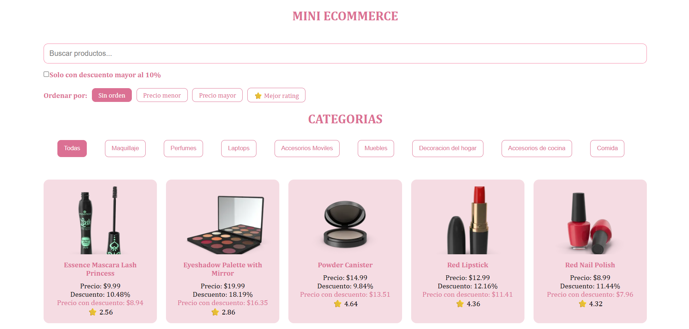
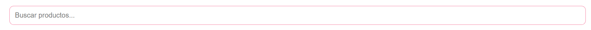
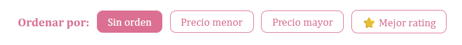
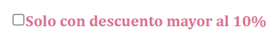
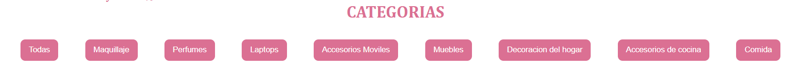

# 🛒 Mini Ecommerce en React

## 📌 Descripción del proyecto

Este proyecto consiste en un mini ecommerce desarrollado con React, el cual consume una API externa para mostrar productos de manera dinámica.

La aplicación permite visualizar una lista de productos y aplicar diferentes filtros para mejorar la experiencia del usuario. Se implementaron funcionalidades como búsqueda en tiempo real, filtrado por categorías, filtrado por productos con descuento mayor a 10%, orden de precio menor a mayor / mayor a menor / mejor rating.

Los datos de los productos se obtienen desde la API pública de DummyJSON.

---

## ⚙️ Tecnologías utilizadas

* React
* JavaScript
* CSS
* API (DummyJSON)
* Vite

---

## 🚀 Cómo ejecutar el proyecto localmente

1. Clonar el repositorio:

```bash
git clone https://github.com/iag1807/mi-ecommerce.git
```

2. Ingresar a la carpeta del proyecto:

```bash
cd mi-ecommerce
```

3. Instalar las dependencias:

```bash
npm install
```

4. Ejecutar el servidor de desarrollo:

```bash
npm run dev
```

5. Abrir en el navegador:

```
http://localhost:5173
```

---

## 🔍 Funcionalidades principales

* 🔎 Búsqueda de productos en tiempo real
* 💸 Filtro de productos con descuento mayor al 10%
* 🗂️ Ordenar por: precio menor, precio mayor y mejor rating
* 🗂️ Filtro por categorías
* 🖼️ Visualización de imagen, nombre y precio de los productos
* ⭐ Visualización de calificación (rating)

---

## 🧩 Estructura del proyecto

```
src/
│
├── components/
│   ├── ProductCard.jsx
│   ├── SearchBar.jsx
│   └── CategoryFilter.jsx
│
├── styles/
│   ├── ProductCard.css
│   ├── SearchBar.css
│   └── CategoryFilter.css
|   └── index.css
│
└── App.jsx
└── main.jsx
└── README.md

```

## 📸 Capturas de pantalla

### 🖥️ Vista principal



### 🔎 Búsqueda de productos



### 🗂️ Ordenar por



### 💸 Filtro por descuento



### 🗂️ Filtro por categorías
    


---

## 👩‍💻 Autor

Proyecto realizado por **Isabella Acevedo Gomez**

---

## 📌 Notas adicionales

Este proyecto fue desarrollado como parte de un taller práctico de React, aplicando conceptos como:

* Componentes funcionales
* Props
* Hooks (useState, useEffect)
* Consumo de APIs
* Renderizado dinámico
* Manejo de eventos
